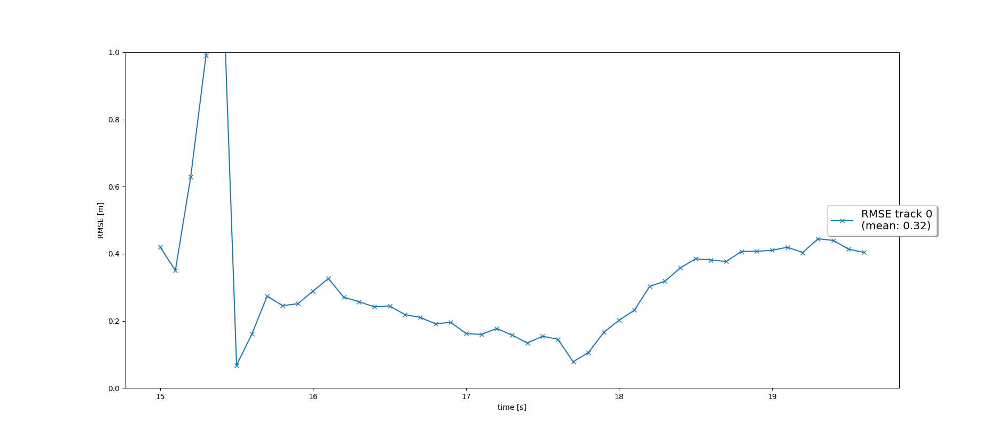
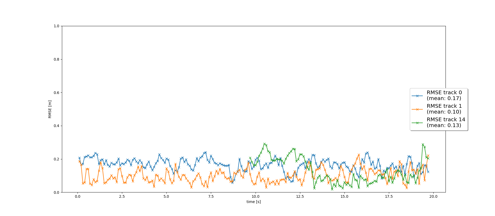

# Project 3: Sensor Fusion and Object Tracking

## Write a short recap of the four tracking steps and what you implemented there (EKF, track management, data association, camera-lidar sensor fusion). Which results did you achieve? Which part of the project was most difficult for you to complete, and why?

### Step 1 

In this step, I completed an extended Kalman Filter. It was a straightforward implementation of the algorithm. However it ended up being the hardest part for me because of a typo in my Q() function (it returned 0 rather than the correct matrix) which I did not notice until I failed to get the expected results in step 4. Because it was not noticed until then, I had trouble tracking it down. Results are shown below:

### Step 2

In step 2, I implemented track management to create and delete tracks, keeping a state and score for each track. It was straightforward and very similar to what had been done earlier excises in the course. RMSE graph is below:

### Step 3

In this step, I added nearest neighbor association to associate measurements to tracks. As with the previous step it was a simple adaptation of earlier exercises, although as shown in the below graph, measurements frequently failed to be associated to the correct track because the error from step one was causing it to have too low estimated covariances.  

### Step 4

In this step, I implemented the camera measurement model and added camera measurements to the EKF tracking. That implementation itself was similar to earlier exercises, but it was here that I noticed and fixed the problem in my EKF implementation. 

## Do you see any benefits in camera-lidar fusion compared to lidar-only tracking (in theory and in your concrete results)?

There could be significant benefits to camera-lidar fusion in theory, both because it simply adds more data for tracking and because the camera and lidar sensors have different strengths: for example lidar measures distance directly and does not rely on ambient light but does depend on reflectivity to the laser used. However in this project I saw only a small decrease in RMSE, because the lidar alone already worked well. 

## Which challenges will a sensor fusion system face in real-life scenarios? Did you see any of these challenges in the project?

Real life sensor fusion systems would face challenges from variable weather and lighting conditions, unpredictable motion of objects, and the cost of computing and sensor hardware. Only the second of these could be an issue in this project, but it seems that the suggested covariance and chi-squared parameters were appropriate to handle it.

## Can you think of ways to improve your tracking results in the future?

Additional data could be used, such as velocity measurements from lidar and additional cameras with different FOVs. 
